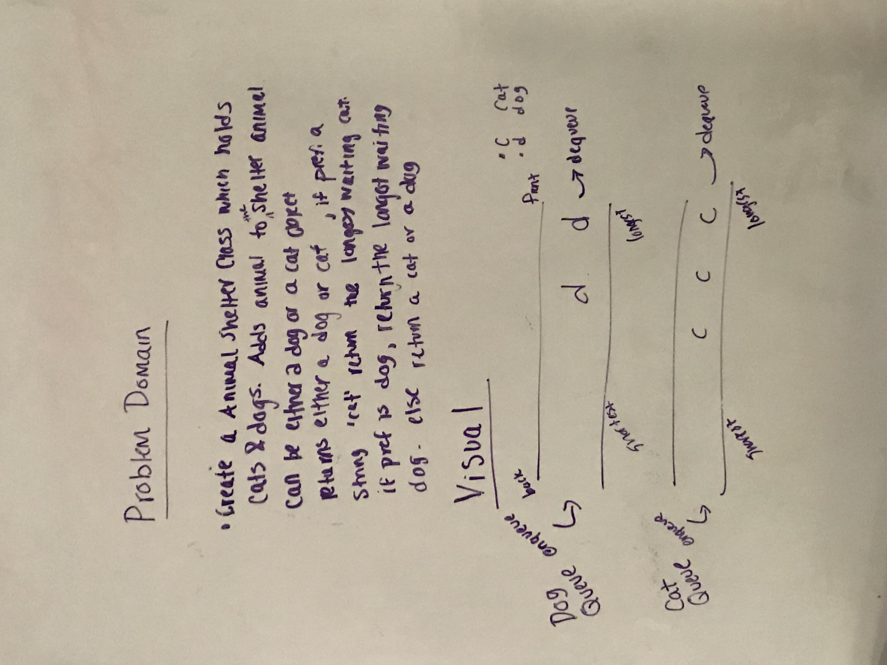
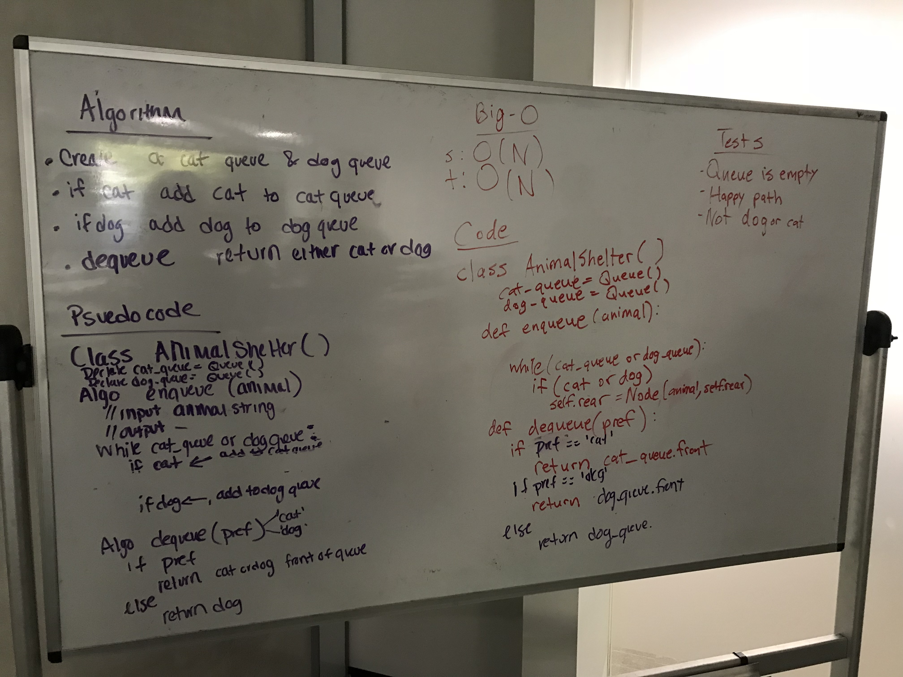

# First-in, First out Animal Shelter.

First-in, First out Animal Shelter.

## Challenge
- [x] Create a class called AnimalShelter which holds only dogs and cats.
- [x] The shelter operates using a first-in, first-out approach.
- [x] Implement the following methods:
- [x] enqueue(animal): adds animal to the shelter. animal can be either a dog or a cat object.
- [x] dequeue(pref): returns either a dog or a cat. If pref, a string, is ‘cat’ return the longest-waiting cat. If pref is ‘dog’, return the longest-waiting dog. For anything else, return either a cat or a dog.

## Solution

