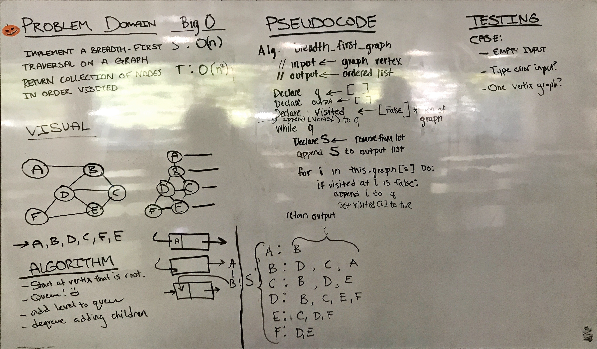

# Breadth-First Traversal of a Graph
Extend your graph object with a breadth-first 
traversal method that accepts a starting node

## Challenge
Implement a breadth-first traversal on a graph.

## Solution
 
