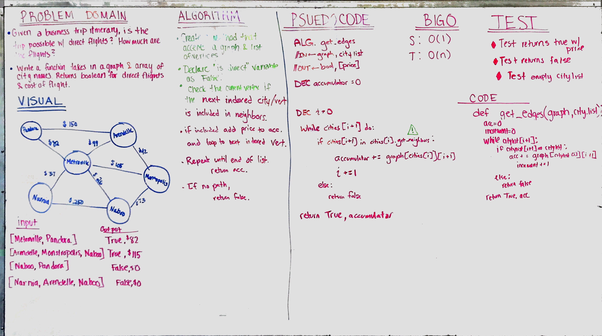
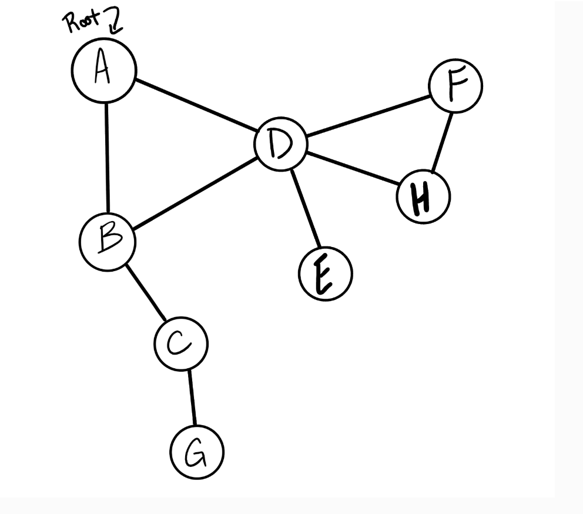
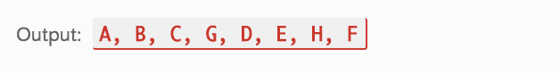

# Depth First Traversal
Conduct a depth first preorder traversal on a acyclic graph. 

## Challenge
Create a function that accepts an adjacency list as a graph, and conducts a depth first traversal.

## Solution

 
